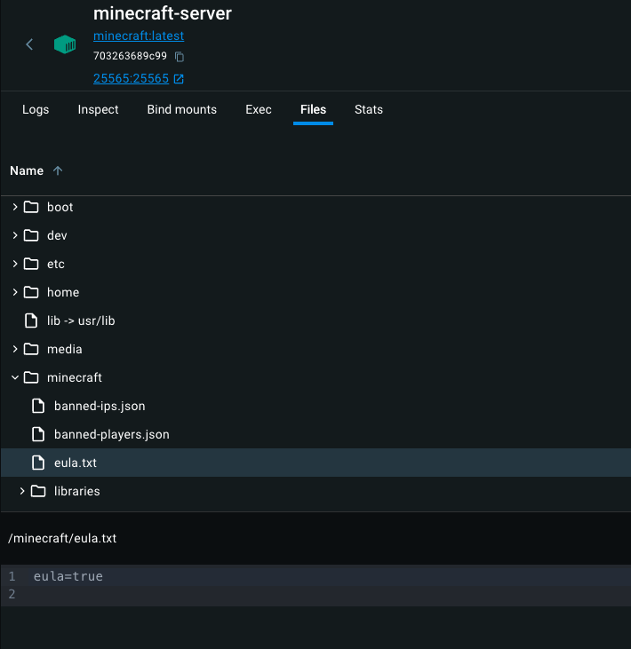
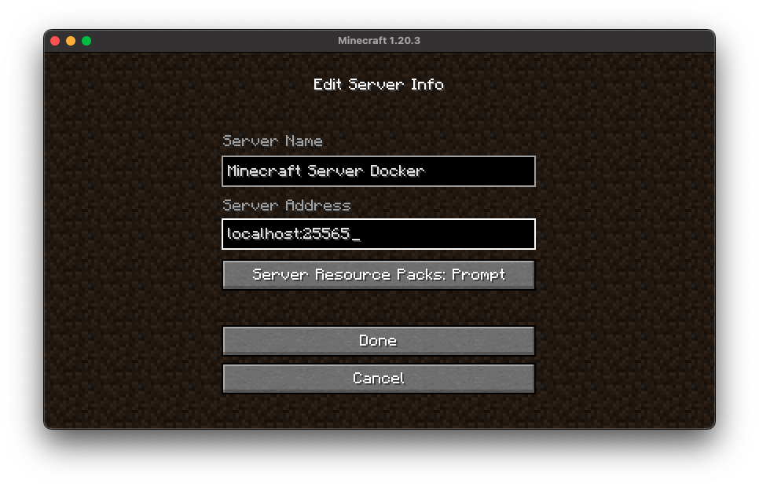

# Introduction

Building a Minecraft server container image using Docker.
The Dockerfile is used to create an image from a vanilla Ubuntu machine and downloading Minecraft server.
Once the container is running, the server is hosted on the local machine. 

## Prerequisites

- Minecraft Launcher + account
- Docker

# Dockerfile

Some details about the Dockerfile:

## Dependencies

In this section, the package manager is used to install the required dependencies for Minecraft Server and making the container lightweight:
- openjdk allows to run Java commands which are need to configure the server
- wget is used to donwload the Minecraft Server application over the internet
- removing some files so that the container size is minimal

```Dockerfile
RUN apt-get update && apt-get install -y \
    openjdk-17-jdk \
    wget \
    && rm -rf /var/lib/apt/lists/*

# Using wget to download Minecraft server from the internet
RUN wget -O server.jar https://piston-data.mojang.com/v1/objects/4fb536bfd4a83d61cdbaf684b8d311e66e7d4c49/server.jar
```

## Eula

In order to host a Minecraft Server you must agree to the eula. A text file will be saved inside the /Minecraft directory. Minecraft Server then checks if the file exsist whether it is set to true.

```Dockerfile
RUN echo "eula=true" > eula.txt
```

If we insepct the files of the container on Docker Desktop, the eula.txt we created is in the correct directory:



## Port Mapping

Minecraft servers run on port 25565. The container will listen to port 25565 for traffic.

```Dockerfile
# Port for Minecraft server
EXPOSE 25565
```

## Java Command

As mentioned previously, Minecraft Server uses java commands to configure the server. This command is required to start the server. The following are specified:
- `Xmx1024M` is the server memory
- `server.jar` launches the server and logic necessary to maintain it
- `nogui` will allow to launch the server without the graphical interface

```Dockerfile
# Arguments being passed to java command
#Minecraft server uses java to configure the server
CMD ["java", "-Xmx1024M", "-Xms1024M", "-jar", "server.jar", "nogui" ]
```

# Connecting to the Server

`docker logs minecraft-server`

Inspecting the logs of the container, we will see which Version of Minecraft we need to run. This is important when we launch the minecraft client, we have to make sure it is the same version.

In the log we will see this:

```
[Server thread/INFO]: Starting minecraft server version 1.20.3
```



# Docker CLI Commands

I ran my container using the CLI, but a docker-compose file could've also been used.

`docker build -t minecraft:latest .`
- Make sure directory is where Dockerfile is

`docker image ls`
- Will show the newly created image

`docker run -p 25565:25565 --name minecraft-server -d minecraft:latest`
- Need to mention the port mapping, running the 'minecraft-server' container in the background. 
- This will start the container and the server will be building, takes a few seconds for the server to finish building.

`docker ps`
- Will show the server container

`docker logs minecraft-server`
- Shows logs for the container

# Next steps

- Have a container volume that is used to store all the server data. This means that if the server fails, player's progression is not lost.
- Include mods, these would be saved inside the container volume
- Deploy to the cloud so that the server is not hosted on local machine.


